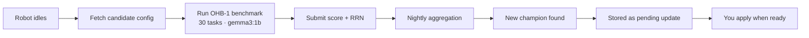

# Harness Research

The OpenCastor fleet runs distributed harness evaluation — searching 263,424 possible configurations to find the optimal AI agent harness for robotics tasks.

## The problem

AI agent harness configuration matters. Changing `max_iterations` from 8 to 6, or `thinking_budget` from 2048 to 1024, can mean the difference between a task completing cleanly and an agent drifting into repeated retries. But the right values depend on hardware, task type, and model.

No one runs enough robots to explore this space alone. A fleet can.

## The search space

8 axes, 263,424 total configurations:

| Axis | Values | Options |
|---|---|---|
| `max_iterations` | 3–10 | 8 |
| `thinking_budget` | 256–4096 | 7 |
| `context_budget` | 2048–32768 | 7 |
| `cost_gate_usd` | 0.001–0.10 | 7 |
| `retry_on_error` | true/false | 2 |
| `drift_detection` | true/false | 2 |
| `p66_consent_threshold` | physical/digital/none | 3 |
| `pattern` | 4 patterns | 4 |
| `memory_backend` | working/filesystem/firestore | 2 (for research) |

**Explored so far:** 435 configs (0.17%)  
**Current champion:** `lower_cost` — OHB-1 score **0.6541**

## How it works



1. Your robot fetches a candidate harness config from the queue
2. Runs the [OHB-1 benchmark](ohb1-benchmark.md) — 30 real robotics tasks using `gemma3:1b` via local Ollama
3. Score + your RRN submitted to Firestore (`harness_eval_results`)
4. Nightly pipeline finds the highest-scoring config across all contributors
5. Champion stored as `harness_pending` in Firestore — **never auto-applied**
6. You apply it via app or CLI when ready

## Tracks

Three research tracks run in parallel:

| Track | Focus | What it varies |
|---|---|---|
| **Track A** — HarnessParam | Core tunables | cost/tokens/timeout combos |
| **Track B** — Architecture | Execution pattern | pattern names (single, init/exec, multi) |
| **Track C** — Skill | Skill sets | skill_set combinations |

## Contributor lineage

Every evaluation is attributed to the contributing robot's RRN. Firestore stores:

```json
{
  "candidate_id": "lower_cost",
  "evaluated_by": "RRN-000000000001",
  "score": 0.6541,
  "evaluated_at": "2026-03-21T...",
  "is_champion": true
}
```

See [Contributing Compute](contributing.md) and [Castor Credits](../runtime/credits.md).
