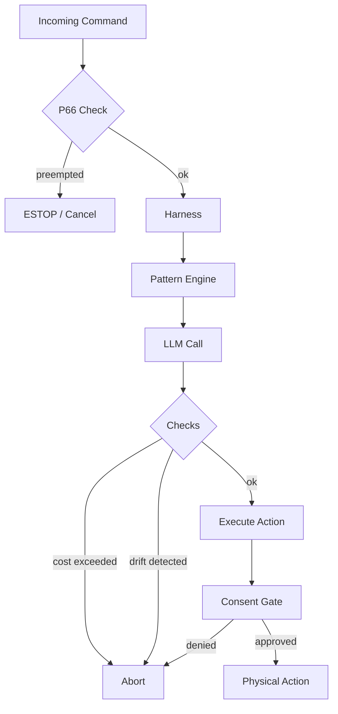

# Agent Harness

The agent harness is OpenCastor's execution engine — it wraps the AI model with safety, cost control, drift detection, and retry logic.

## Architecture



## Harness config schema

```yaml
harness:
  # Core tunables
  max_iterations: 8
  thinking_budget: 2048
  context_budget: 16384
  cost_gate_usd: 0.05
  retry_on_error: true
  drift_detection: true
  p66_consent_threshold: physical

  # Pattern layer (new in v2026.3.27)
  pattern:
    name: single_agent_supervisor   # single_agent_supervisor | initializer_executor | multi_agent
    config: {}

  # Memory layer (new in v2026.3.27)
  memory:
    backend: working                # working | filesystem | firestore
    overflow_strategy: summarize    # summarize | drop_oldest | error
    max_tokens: 8192

  # Security/observability layer (new in v2026.3.27)
  security:
    guardrail: none                 # none | opa
    telemetry: false
    telemetry_endpoint: ""
```

## Pattern engine

Three execution patterns are supported:

### `single_agent_supervisor`
Default. One agent handles the full task loop with a supervisor that checks for drift and budget violations.

### `initializer_executor`
Two-phase: an initializer decomposes the task and creates a ledger; an executor works through the ledger steps. Good for complex multi-step physical tasks.

### `multi_agent`
Parallel branches with a coordinator. Useful for server-class hardware with available VRAM.

## Memory backends

| Backend | Use case |
|---|---|
| `working` | In-memory (default, fastest, no persistence) |
| `filesystem` | Persists to `/tmp/castor_memory_{session}.json` |
| `firestore` | Fleet-visible, persists across sessions |

## Champion configs

The [research pipeline](../research/overview.md) finds the optimal harness config for your hardware tier. The current fleet champion:

| Key | Value |
|---|---|
| `candidate_id` | `lower_cost` |
| `cost_gate_usd` | `0.01` |
| `thinking_budget` | `1024` |
| `context_budget` | `8192` |
| `max_iterations` | `6` |
| `OHB-1 score` | `0.6541` (21/30 tasks) |

Apply it: `castor harness apply-champion`
